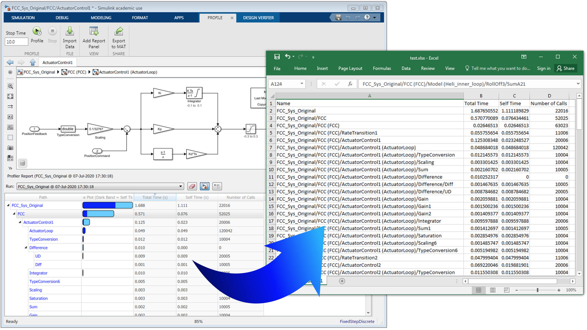

# SimulinkProfiler-To-Excel
#### Convert Simulink Profiler data into an Excel spreadsheet.

Converts [Simulink Profiler](https://www.mathworks.com/help/simulink/slref/introduction-to-profiling-models.html) data into an Excel spreadsheet. Currently, the Simulink Profiler only supports exporting data to a MAT file. After loading the profiler data into the base workspace, you can use this script to convert it into an Excel file.
